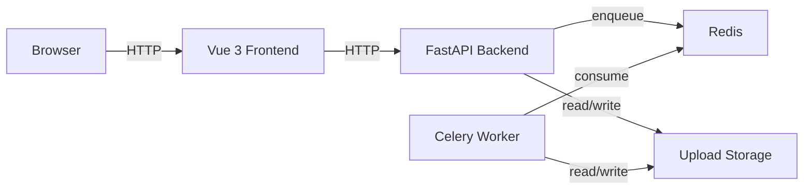

# AI Subtitle Tool

## Project Overview

AI Subtitle Tool is a delivery-focused subtitle workflow for video uploads. It provides a FastAPI backend, Celery worker, Redis queue, and a Vue 3 frontend for upload, status polling, subtitle editing, batch processing, and result download.

## Features

- Single-file upload with task polling.
- Batch upload with ZIP download of completed results.
- Subtitle editing for `srt` and `ass`.
- Explicit final-video rebuild after subtitle edits.
- Frontend-safe task status contract with `warnings`, `error_code`, and `suggestion`.
- Release packaging script that excludes local secrets and runtime artifacts.

## Architecture



## Quick Start: Docker Compose

Docker Compose is the fastest way to run the full stack locally.

```bash
cp backend/.env.example backend/.env
cp frontend/.env.example frontend/.env
docker compose config
docker compose up --build
```

Services:

- Frontend: [http://localhost:5173](http://localhost:5173)
- Backend API: [http://localhost:9091](http://localhost:9091)
- Backend health: [http://localhost:9091/healthz](http://localhost:9091/healthz)

Notes:

- `docker-compose.yml` uses `backend/.env.example` as the default backend env source so `docker compose up` works out of the box.
- The frontend Docker image is built with `VITE_API_BASE_URL=http://localhost:9091` so browser requests hit the mapped backend port.
- Runtime artifacts are mounted to `backend/uploads`, `backend/outputs`, and `backend/tmp`.

## Local Development: Backend

Requirements:

- Python 3.11
- Redis
- `ffmpeg` and `ffprobe`

Setup:

```bash
python -m venv venv
# Windows: venv\Scripts\activate
# macOS/Linux: source venv/bin/activate
pip install -r requirements.txt
cp backend/.env.example backend/.env
```

Recommended local overrides inside `backend/.env`:

```ini
REDIS_URL=redis://localhost:6379/0
CELERY_BROKER_URL=redis://localhost:6379/0
CELERY_RESULT_BACKEND=redis://localhost:6379/1
UPLOAD_DIR=./backend/uploads
OUTPUT_DIR=./backend/outputs
TEMP_DIR=./backend/tmp
```

Run the backend stack:

```bash
redis-server
celery -A backend.celery_app:celery_app worker --loglevel=info
uvicorn backend.main:app --host 0.0.0.0 --port 8000
```

Health endpoints:

- `GET /healthz`
- `GET /readyz`
- `GET /api/config`

## Local Development: Frontend

```bash
cd frontend
npm ci
cp .env.example .env
npm run dev
```

Frontend env:

```ini
VITE_API_BASE_URL=http://localhost:8000
VITE_APP_TITLE=AI Subtitle Tool
```

## Testing

Backend:

```bash
python -m pytest -q
python -m compileall backend tests scripts
```

Frontend:

```bash
cd frontend
npm ci
npm audit
npm run lint
npm run typecheck
npm run test:ci
npm run build
```

Notes:

- `npm test` starts Vitest watch mode for local development.
- `npm run test:ci` is the CI-safe, non-watch command and must exit on its own.

Docker contract:

```bash
python scripts/verify_docker_config.py
docker compose config
docker compose up --build
```

Benchmark smoke:

```bash
python benchmarks/run_benchmarks.py --smoke
```

`--smoke` is CI-safe and does not download Whisper models. For local machine-specific measurements, see [benchmarks/performance_report.md](benchmarks/performance_report.md).

## Release Packaging

Use the Python script as the single source of truth:

```bash
python scripts/make_release_zip.py --out release.zip --check
```

End-to-end delivery verification:

```bash
python scripts/verify_delivery.py --zip-only
python scripts/verify_delivery.py --full
```

`--zip-only` validates docs, Docker/release inputs, and the clean release archive.
`--full` additionally runs Python compile checks, backend pytest, frontend `npm ci`, `lint`, `typecheck`, `test:ci`, `build`, then rebuilds and verifies `release.zip`.

PowerShell wrapper:

```powershell
powershell -ExecutionPolicy Bypass -File .\make_release_zip.ps1
```

The release ZIP keeps:

- `backend/.env.example`
- `frontend/.env.example`
- `README.md`
- `DEPLOYMENT.md`
- `docker-compose.yml`
- `backend/Dockerfile`
- `frontend/Dockerfile`
- test files

The release ZIP excludes:

- `.git/`
- `node_modules/`
- `dist/`
- `build/`
- `__pycache__/`
- `.pytest_cache/`
- `.venv/`
- `venv/`
- `.env`
- `.env.local`
- `backend/.env`
- `frontend/.env`
- `*.key`
- `*.pem`
- `secrets.*`
- `uploads/`
- `outputs/`
- `temp/`
- `tmp/`

## Environment Variables

Backend example: [backend/.env.example](backend/.env.example)

Important variables:

- `APP_ENV`
- `ENVIRONMENT`
- `API_HOST`
- `API_PORT`
- `CORS_ORIGINS`
- `UPLOAD_DIR`
- `OUTPUT_DIR`
- `TEMP_DIR`
- `MAX_UPLOAD_SIZE_MB`
- `MAX_BATCH_FILES`
- `REDIS_URL`
- `CELERY_BROKER_URL`
- `CELERY_RESULT_BACKEND`
- `OPENAI_API_KEY`
- `OPENAI_MODEL`
- `TRANSLATE_MODEL`
- `WHISPER_MODEL`
- `FFMPEG_BINARY`
- `FFPROBE_BINARY`
- `FFMPEG_PRESET`
- `STORAGE_BACKEND`
- `S3_ENDPOINT`
- `S3_ACCESS_KEY`
- `S3_SECRET_KEY`
- `S3_REGION`
- `S3_BUCKET`

Frontend example: [frontend/.env.example](frontend/.env.example)

- `VITE_API_BASE_URL`
- `VITE_APP_TITLE`

## Known Limitations

- End-to-end media processing still depends on local `ffmpeg`, Redis, and a running Celery worker.
- Real transcription and translation are mocked in tests; the default suite does not call external APIs.
- Batch ZIP names include the sanitized original filename, task id, and language suffix to avoid collisions when multiple target languages are generated.
- Batch ZIP includes VTT subtitles generated from SRT using the same conversion path as single-file VTT downloads.

## Portfolio Highlights

- Strong API contract coverage between FastAPI and Vue.
- Delivery verification script checks docs, env examples, Docker config, release ZIP contents, tests, and frontend build steps.
- Stable release packaging uses one Python implementation and a thin PowerShell wrapper, which avoids duplicated exclusion rules.

Batch ZIP naming:

- Subtitle files use `{safe_original_filename}_{task_id}_{language}.srt`
- Subtitle files use `{safe_original_filename}_{task_id}_{language}.ass`
- Subtitle files use `{safe_original_filename}_{task_id}_{language}.vtt`
- Final video uses `{safe_original_filename}_{task_id}.mp4`
