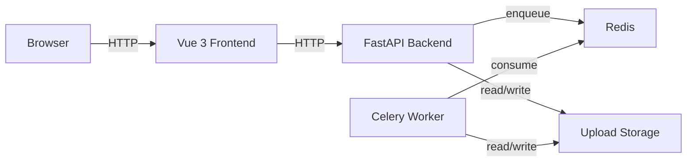

# AI Subtitle Tool

## Project Overview

AI Subtitle Tool is a delivery-focused subtitle workflow for video uploads. It provides a FastAPI backend, Celery worker, Redis queue, and a Vue 3 frontend for upload, status polling, subtitle editing, batch processing, and result download.

## Features

- Single-file upload with task polling.
- Batch upload with ZIP download of completed results.
- Subtitle editing for `srt` and `ass`.
- Explicit final-video rebuild after subtitle edits.
- Frontend-safe task status contract with `warnings`, `error_code`, and `suggestion`.
- Release packaging script that excludes local secrets and runtime artifacts.
- **One-click development setup** with F5 in VS Code or command-line scripts.

## Architecture



## Quick Start: One-Click Development (Recommended)

### Option A: Docker Compose

```bash
cp backend/.env.example backend/.env
cp frontend/.env.example frontend/.env
docker compose up --build
```

Services:

- Frontend: [http://localhost:5173](http://localhost:5173)
- Backend API: [http://localhost:9091](http://localhost:9091)
- Backend health: [http://localhost:9091/healthz](http://localhost:9091/healthz)

### Option B: VS Code F5

1. Clone and open the project in VS Code.
2. Press **F5** to launch the backend, frontend, and worker stack.
3. Wait for the terminal messages:
   ```
   [BACKEND] Application startup complete
   [FRONTEND] VITE ready in ...
   [WORKER] ready
   ```
4. Open [http://localhost:5173](http://localhost:5173)
5. Open the backend API docs at [http://127.0.0.1:8891/docs](http://127.0.0.1:8891/docs)

### Option C: Manual Local Development

## Local Development: Backend

Requirements:

- Python 3.11 or 3.12 is required.
- Recommended: Python 3.11
- Supported: Python 3.11-3.12
- Unsupported: Python 3.13+
- Redis (running separately)
- `ffmpeg` and `ffprobe`

Setup:

```bash
python -m venv .venv
# Windows: .venv\Scripts\activate
# macOS/Linux: source .venv/bin/activate
python -m pip install -r requirements.lock.txt
cp backend/.env.example backend/.env
```

If you use an unsupported interpreter, bootstrap and delivery verification fail fast with:

```txt
Python 3.11 or 3.12 is required. Current version: x.y.z
```

Backend dependencies must be installed before running pytest or `scripts/verify_delivery.py --full`.

Recommended local overrides inside `backend/.env`:

```ini
REDIS_URL=redis://127.0.0.1:6379/0
CELERY_BROKER_URL=redis://127.0.0.1:6379/0
CELERY_RESULT_BACKEND=redis://127.0.0.1:6379/1
UPLOAD_DIR=backend/uploads
OUTPUT_DIR=backend/outputs
TEMP_DIR=backend/tmp
RATE_LIMIT_PER_IP=0
```

Run the backend stack (in separate terminals):

```bash
# Terminal 1: Redis
redis-server

# Terminal 2: Celery worker
celery -A backend.celery_app:celery_app worker --loglevel=info

# Terminal 3: Backend API
uvicorn backend.main:app --host 127.0.0.1 --port 8891 --reload
```

Health endpoints:

- `GET /healthz`
- `GET /readyz`
- `GET /api/config`
- API docs: [http://127.0.0.1:8891/docs](http://127.0.0.1:8891/docs)

## Local Development: Frontend

```bash
cd frontend
nvm use
npm ci
cp .env.example .env
npm run dev
```

Node.js 20.x is required. Use `.nvmrc` or `nvm use` before running frontend commands. The frontend toolchain and `@types/node` are intentionally aligned to Node 20 for easier maintenance.

Frontend env:

```ini
VITE_API_BASE_URL=http://127.0.0.1:8891
VITE_API_TOKEN=your-token
VITE_APP_TITLE=AI Subtitle Tool
```

Local frontend page: [http://127.0.0.1:5173](http://127.0.0.1:5173)

## Testing

Backend:

```bash
python -m pytest -q
python -m compileall backend tests scripts
```

Frontend:

```bash
cd frontend
nvm use
npm ci
npm audit --omit=dev
npm run lint
npm run typecheck
npm run test:ci
npm run build
```

Notes:

- `npm test` starts Vitest watch mode for local development.
- `npm run test:ci` is the CI-safe, non-watch command and must exit on its own.
- Production audit uses `npm audit --omit=dev` and must pass with 0 vulnerabilities.
- Full `npm audit` can still report dev dependency advisories; those are tracked separately. dev dependency advisories are not production runtime risks unless they move into runtime dependencies.

Auth and rate limiting are enforced by middleware when enabled. Local demo defaults keep auth off and set `RATE_LIMIT_PER_IP=0` to avoid blocking long polling; production should set `REQUIRE_AUTH_TOKEN=true`, `AUTH_TOKEN`, and a positive `RATE_LIMIT_PER_IP`.

Docker contract:

```bash
python scripts/verify_docker_config.py
docker compose config
docker compose up --build
```

Benchmark smoke:

```bash
python benchmarks/run_benchmarks.py --smoke
```

`--smoke` is CI-safe and does not download Whisper models. For local machine-specific measurements, see [benchmarks/performance_report.md](benchmarks/performance_report.md).

## Release Packaging

- GitHub Actions workflow exists in the source repository but is excluded from release archives.


Use the Python script as the single source of truth:

```bash
python scripts/make_release_zip.py --out release.zip --check
```

End-to-end delivery verification:

```bash
python -m pip install -r requirements.lock.txt
cd frontend
npm ci
cd ..
python scripts/verify_delivery.py --zip-only
python scripts/verify_delivery.py --full
```

`--zip-only` validates docs, Docker/release inputs, and the clean release archive.
`--full` additionally runs Python compile checks, backend dependency preflight, backend pytest, frontend `npm ci`, `lint`, `typecheck`, `test:ci`, `build`, production `npm audit --omit=dev`, then rebuilds and verifies `release.zip`.

If backend dependencies are missing, `--full` stops before pytest with a clear preflight error such as:

```txt
[backend-preflight] Missing backend dependencies: celery, pytest-timeout

Please run:
python -m pip install -r requirements.lock.txt
```

Fast verification aliases:

```bash
python scripts/verify_delivery.py --full --ci-fast
python scripts/verify_delivery.py --full --smoke
```

Fast mode prints an explicit warning banner and is not a full release verification.

PowerShell wrapper:

```powershell
powershell -ExecutionPolicy Bypass -File .\make_release_zip.ps1
```

The release ZIP keeps:

- `backend/.env.example`
- `frontend/.env.example`
- `README.md`
- `DEPLOYMENT.md`
- `docker-compose.yml`
- `backend/Dockerfile`
- `frontend/Dockerfile`
- test files

The release ZIP excludes:

- `.git/`
- `node_modules/`
- `dist/`
- `build/`
- `__pycache__/`
- `.pytest_cache/`
- `.venv/`
- `venv/`
- `.env`
- `.env.local`
- `backend/.env`
- `frontend/.env`
- `.vscode/`
- `scripts/dev_bootstrap.py`
- `scripts/dev_start.py`
- `scripts/start-dev.cmd`
- `scripts/start-dev.ps1`
- `scripts/stop-dev.ps1`
- `*.key`
- `*.pem`
- `secrets.*`
- `uploads/`
- `outputs/`
- `temp/`
- `tmp/`

## Environment Variables

Backend example: [backend/.env.example](backend/.env.example)

Important variables:

- `APP_ENV`
- `ENVIRONMENT`
- `API_HOST`
- `API_PORT`
- `CORS_ORIGINS`
- `UPLOAD_DIR`
- `OUTPUT_DIR`
- `TEMP_DIR`
- `MAX_UPLOAD_SIZE_MB`
- `MAX_BATCH_FILES`
- `REDIS_URL`
- `CELERY_BROKER_URL`
- `CELERY_RESULT_BACKEND`
- `OPENAI_API_KEY`
- `LLM_PROVIDER`
- `OPENAI_MODEL`
- `TRANSLATE_MODEL`
- `OLLAMA_BASE_URL`
- `OLLAMA_MODEL`
- `WHISPER_MODEL`
- `FFMPEG_BINARY`
- `FFPROBE_BINARY`
- `REPORT_EXPORT_TIMEOUT_SECONDS`
- `FFMPEG_PRESET`
- `STORAGE_BACKEND`
- `S3_ENDPOINT`
- `S3_ACCESS_KEY`
- `S3_SECRET_KEY`
- `S3_REGION`
- `S3_BUCKET`
- `REQUIRE_AUTH_TOKEN` enables token auth for non-health API routes. Send either `Authorization: Bearer <token>` or `X-API-Token: <token>`.
- `AUTH_TOKEN` is required when `REQUIRE_AUTH_TOKEN=true`.
- `RATE_LIMIT_PER_IP` limits requests per IP per hour. `0` disables the middleware limit for local development; use a positive integer in production.
- `FFMPEG_TIMEOUT_SECONDS` / `FFPROBE_TIMEOUT_SECONDS` bound media subprocess runtime.
- `REPORT_EXPORT_TIMEOUT_SECONDS` bounds experimental PDF report conversion runtime; default is `120`.
- Frontend deployments can set `VITE_API_TOKEN` to send `X-API-Token` automatically on every API request.

Whisper model selection priority:

1. Per-task `model_size` option, when supplied by the caller.
2. `WHISPER_MODEL`, when set in the backend environment.
3. Automatic duration-based selection when neither of the above is set.

Storage backend selection is explicit:

1. `STORAGE_BACKEND=local` always uses local file storage, even when S3 variables are present.
2. `STORAGE_BACKEND=s3` enables S3 and requires `S3_BUCKET`.
3. Any other `STORAGE_BACKEND` value fails fast with a configuration error.

Do not rely on `S3_BUCKET` alone to enable S3 storage.

Frontend example: [frontend/.env.example](frontend/.env.example)

- `VITE_API_BASE_URL`
- `VITE_APP_TITLE`

## Translation Provider Configuration

### Transcribe Mode (Original Language Only)

To generate subtitles in the original language only (no translation):

1. **No OpenAI API Key needed**
2. Set `LLM_PROVIDER=none` or leave translation disabled in the UI
3. Upload with single target language (e.g., "Original")
4. System will transcribe video to text without translation

`/healthz` and `/readyz` do not fail solely because translation is disabled or `OPENAI_API_KEY` is missing. Translation provider issues should not block upload, FFmpeg, Redis, or subtitle generation for `Original`.

### Translate Mode With Ollama (No OpenAI Key Required)

To generate translated subtitles with a local Ollama instance:

1. Set in `backend/.env`:
   ```ini
   LLM_PROVIDER=ollama
   TRANSLATE_PROVIDER=ollama
   OLLAMA_BASE_URL=http://127.0.0.1:11434
   OLLAMA_MODEL=gemma3:12b
   OPENAI_API_KEY=
   ```
2. Start Ollama and confirm `http://127.0.0.1:11434/api/tags` responds.
3. Upload with translated target languages (for example `Traditional Chinese, English`).
4. The frontend should show `已啟用 Ollama：gemma3:12b` when translation is ready.

### Translate Mode With OpenAI

To generate subtitles in multiple languages (original + translations):

1. **Get OpenAI API Key** from [https://platform.openai.com/api-keys](https://platform.openai.com/api-keys)
2. Set in `backend/.env`:
   ```ini
   LLM_PROVIDER=openai
   TRANSLATE_PROVIDER=openai
   OPENAI_API_KEY=sk-...
   OPENAI_MODEL=gpt-4o-mini
   TRANSLATE_MODEL=gpt-4o-mini
   ```
3. Upload with multiple target languages (e.g., "Traditional Chinese, English")
4. System will transcribe AND translate subtitles

### Configuration Check

Call `/api/capabilities` to check current provider status:

```bash
curl http://127.0.0.1:8891/api/capabilities
```

Response includes:
- `provider`: `openai`, `ollama`, or `none`
- `model`: the active translation model for the selected provider
- `translationEnabled`: whether translation is currently available
- `reason`: a machine-readable reason when translation is unavailable
- `availableModes`: list of available modes (`["transcribe"]` or `["transcribe", "translate"]`)

`/api/config` mirrors the same capability fields alongside upload-size and subtitle-format settings. If translation is not configured, uploading with multiple languages fails with a provider-specific error message, while `Original` still works.

## Known Limitations

- End-to-end media processing still depends on local `ffmpeg`, Redis, and a running Celery worker.
- Real transcription and translation are mocked in tests; the default suite does not call external APIs.
- Batch ZIP names include the sanitized original filename, task id, and language suffix to avoid collisions when multiple target languages are generated.
- Batch ZIP includes VTT subtitles generated from SRT using the same conversion path as single-file VTT downloads.
- **S3 storage is experimental**; local file storage is the default and fully supported.

## Portfolio Highlights

- Strong API contract coverage between FastAPI and Vue.
- Delivery verification script checks docs, env examples, Docker config, release ZIP contents, tests, and frontend build steps.
- Stable release packaging uses one Python implementation and a thin PowerShell wrapper, which avoids duplicated exclusion rules.

Batch ZIP naming:

- Subtitle files use `{safe_original_filename}_{task_id}_{language}.srt`
- Subtitle files use `{safe_original_filename}_{task_id}_{language}.ass`
- Subtitle files use `{safe_original_filename}_{task_id}_{language}.vtt`
- `final.mp4` burns only the first selected subtitle language. Other generated languages remain available as subtitle downloads.

## VS Code development

Open a full repository clone in VS Code and press F5. The default launch is `Run Full Stack Dev`, which starts the backend API, Celery worker when Redis is available, and the Vite frontend. Local endpoints:

- Backend API docs: [http://127.0.0.1:8891/docs](http://127.0.0.1:8891/docs)
- Frontend page: [http://127.0.0.1:5173](http://127.0.0.1:5173)

The release zip intentionally excludes `.vscode` and local development helper scripts; use a repo clone for F5 development and the release zip for deployment packaging. See `DEVELOPMENT.md` for first-run setup, Redis behavior, and stop commands.
- Final video uses `{safe_original_filename}_{task_id}.mp4`
