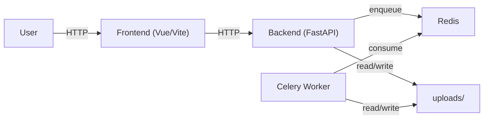

# AI Subtitle Tool

AI subtitle generation and editing tool with a FastAPI backend, Celery workers, Redis, and a Vue 3 frontend.

## Core Flow

1. Upload one or more videos.
2. Backend validates files before enqueueing Celery jobs.
3. Frontend polls `GET /status/{task_id}` or `GET /batch/{batch_id}/status`.
4. Successful tasks expose downloads through `GET /download/{task_id}`.
5. Users can edit subtitle files and explicitly rebuild final video when needed.

## Architecture



## Runtime URLs

- Local backend: `http://localhost:8000`
- Docker backend: `http://localhost:9091`
- Frontend: `http://localhost:5173`

## Repository Layout

- `backend/`: FastAPI app, Celery tasks, batch metadata, uploads runtime directory
- `frontend/`: Vue 3 SPA
- `tests/`: backend tests
- `scripts/`: release and verification helpers

## Environment Files

### Backend

`backend/.env.example` is safe to commit and is used by Docker Compose by default.

For local backend development, copy it to `backend/.env`.

```ini
REDIS_URL=redis://localhost:6379/0
CELERY_BROKER_URL=redis://localhost:6379/0
CELERY_RESULT_BACKEND=redis://localhost:6379/0
UPLOAD_DIR=./backend/uploads
CORS_ALLOWED_ORIGINS=http://localhost:5173
CORS_ALLOW_CREDENTIALS=true
OPENAI_API_KEY=
WHISPER_MODEL=small
AUTO_SEGMENT_THRESHOLD_SECONDS=1800
HF_TOKEN=
TRANSLATE_MODEL=
```

### Frontend

`frontend/.env.example` sets the API base URL used by both API requests and download links.

```ini
VITE_API_BASE_URL=http://localhost:8000
```

Use:

- Local development: `http://localhost:8000`
- Docker demo mode: `http://localhost:9091`
- Same-origin reverse proxy deployments: adjust to your public API origin or leave empty if bundled behind one host

## Local Development

Requirements:

- Python 3.11
- Node.js 20
- Redis
- `ffmpeg` and `ffprobe`

Backend:

```bash
python -m venv venv
# Windows: venv\Scripts\activate
# macOS/Linux: source venv/bin/activate
pip install -r requirements.txt
cp backend/.env.example backend/.env
redis-server
celery -A backend.celery_app:celery_app worker --loglevel=info
uvicorn backend.main:app --host 0.0.0.0 --port 8000
```

Frontend:

```bash
cd frontend
npm ci
npm run dev
```

## Docker Quick Start

`docker-compose.yml` already points at `backend/.env.example`, so the project can boot without creating extra env files:

```bash
docker compose up --build
```

Services:

- Frontend: `http://localhost:5173`
- Backend API: `http://localhost:9091`
- Health check: `http://localhost:9091/healthz`

## Key API Endpoints

- `POST /upload`
- `POST /batch/upload`
- `GET /status/{task_id}`
- `GET /batch/{batch_id}/status`
- `GET /results/{task_id}`
- `GET /download/{task_id}`
- `GET /subtitle/{task_id}`
- `PUT /subtitle/{task_id}`
- `POST /tasks/{task_id}/rebuild-final`

### Download Rules

- Final video: `/download/{task_id}` or `/download/{task_id}?format=video`
- Subtitle SRT: `/download/{task_id}?lang={language}&format=srt`
- Subtitle ASS: `/download/{task_id}?lang={language}&format=ass`
- Subtitle VTT: `/download/{task_id}?lang={language}&format=vtt`

## Batch Processing

Batch uploads create one metadata file per batch:

- Local path: `backend/uploads/batches/{batch_id}.json`
- Docker container path: `/app/uploads/batches/{batch_id}.json`

Batch flow:

1. User selects multiple files in the batch tab.
2. Backend validates every file before enqueueing.
3. Invalid files are marked failed immediately and never sent to Celery.
4. Each valid file becomes its own task.
5. Frontend polls `GET /batch/{batch_id}/status`.
6. Individual task downloads use `/download/{task_id}` URLs.
7. Full batch zip is available from `GET /batch/{batch_id}/download`.

## Testing

Backend:

```bash
python -m pytest -q
```

Frontend:

```bash
cd frontend
npm ci
npm run typecheck
npm run lint
npm run test:ci
npm run build
```

## Delivery Verification

Fast verification:

```bash
python scripts/verify_delivery.py --zip-only
```

Full verification:

```bash
python scripts/verify_delivery.py --full
```

`release.zip` must not contain runtime outputs, caches, `node_modules`, `dist`, local `.env` files, or uploaded media/subtitle artifacts.

## Notes

- Subtitle editing updates subtitle files only; it does not auto-rebuild the final video.
- Batch status values are normalized for UI display, but backend task states remain explicit (`PENDING`, `PROCESSING`, `SUCCESS`, `FAILURE`).
- Recent tasks are available at `GET /tasks/recent`.
