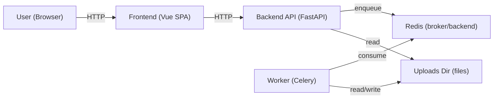
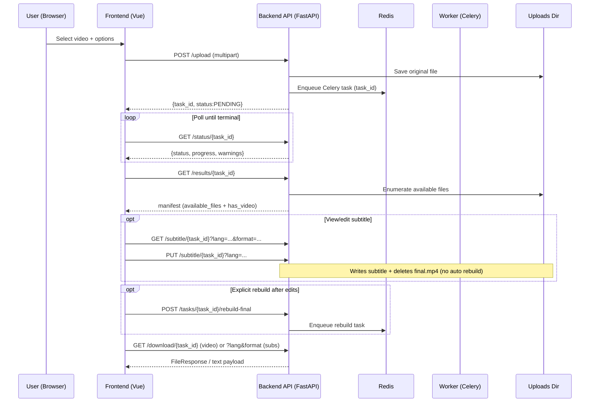

# AI Subtitle Tool

AI subtitle generation + editing tool with a FastAPI backend (Celery + Redis) and a Vue 3 SPA frontend.

Core workflow (must remain stable):

1. Upload video and options
2. Celery task processes the video
3. Frontend polls task status
4. Results manifest lists available outputs (only when task is `SUCCESS`)
5. View/edit subtitles (ASS/SRT)
6. Download final video / subtitles

## Architecture Diagram



## Task Flow Diagram



## Tech Stack

- Backend: FastAPI + Uvicorn
- Task queue: Celery + Redis
- Media: ffmpeg / ffprobe
- STT: faster-whisper
- Translation: OpenAI (optional; controlled by env + options)
- Frontend: Vue 3 + Vite + TypeScript + Vue Router + Pinia (SPA)

## Repo Structure

- `backend/`: FastAPI app + Celery tasks
- `frontend/`: Vue 3 SPA
- `tests/`: backend behavior tests (`pytest`)
- `scripts/`: release helpers (cross-platform)

## Processing Flow

1. Upload (`POST /upload`)
2. Split (optional; long video + parallel mode)
3. Transcribe (faster-whisper)
4. Translate (optional; OpenAI if configured)
5. Generate subtitles (always generates bilingual SRT; optionally generates ASS too)
6. Burn subtitles into final video (optional)
7. Download (`GET /download/{task_id}`) or edit subtitles (`PUT /subtitle/{task_id}`)

## Delivery / Clean Package Rules

Do NOT include these in a release package:

- `.git/`
- `frontend/node_modules/`
- `frontend/dist/`
- `tests/_tmp/`
- `__pycache__/` and `*.pyc`
- `backend/uploads/*` (runtime outputs)

This repo includes `make_release_zip.ps1` which stages a clean tree and produces a zip release package (default output: `release_out/ai_subtitle_tool_release.zip`).

Important: the script does **not** keep a second copy of the source tree (no committed `release_pkg/`). The staging directory is temporary and removed after the zip is created.

Do **NOT** manually zip the repo (Explorer / Finder / `zip -r`). Manual zips routinely ship forbidden artifacts (e.g. `.git/`, `node_modules/`, caches) and are considered a broken release process for this project.

For cross-platform release packaging (CI uses this):

```bash
python scripts/make_release_zip.py --out release.zip --check
```

## Backend Setup

Requirements:

- Python 3.11 (recommended; aligns with Docker/CI)
- `ffmpeg` and `ffprobe`
- Redis

Install:

```bash
python -m venv venv
# Windows: venv\Scripts\activate
# macOS/Linux: source venv/bin/activate
pip install -r requirements.txt
```

Dependencies are locked in `requirements.lock.txt` (single source of truth).
Optional diarization dependencies are in `requirements.optional-diarization.txt`.
For Docker/Linux reproducibility, the lock explicitly pins `faster-whisper==1.0.3` with `av==12.3.0` so PyAV is installed from a prebuilt `cp311` manylinux wheel instead of compiling against system FFmpeg headers during image build.

Environment variables:

- Copy `backend/.env.example` to `backend/.env` (do not commit real keys).
- The backend auto-loads `backend/.env` for local development (it will not override already-set env vars).

```ini
REDIS_URL=redis://localhost:6379/0
UPLOAD_DIR=./uploads
OPENAI_API_KEY=
HF_TOKEN=
TRANSLATE_MODEL=
CORS_ALLOWED_ORIGINS=http://localhost:5173
CORS_ALLOW_CREDENTIALS=true
```

Run services:

```bash
redis-server
celery -A backend.celery_app:celery_app worker --loglevel=info
# optional periodic cleanup
celery -A backend.celery_app:celery_app beat --loglevel=info
uvicorn backend.main:app --host 0.0.0.0 --port 8000
```

Health checks:

- `GET /healthz` returns `{"status":"ok"}`
- `GET /readyz` checks Redis + `UPLOAD_DIR` write access

Backend tests:

```bash
pytest -q
```

Codecov in GitHub Actions:

- Add `CODECOV_TOKEN` at `GitHub Repo Settings > Secrets and variables > Actions` if you want to enable Codecov uploads in CI.
- If `CODECOV_TOKEN` is not configured, the workflow skips the Codecov upload step and the overall CI result is unaffected.

## Frontend Setup

The release package must NOT ship with `frontend/node_modules/`.
Always install in a clean environment:

```bash
cd frontend
rm -rf node_modules
npm ci
npm run lint
npm run typecheck
npm test
npm run build
npm run dev
```

### API Base URL

Configure `VITE_API_BASE_URL` (see `frontend/.env.example`).

- If frontend and backend are same-origin: you can omit it.
- If different-origin: set it to the FastAPI origin (e.g. `http://localhost:9091`).

Important: `VITE_API_BASE_URL` affects BOTH:

- API requests (`/upload`, `/status/...`, `/results/...`, `/subtitle/...`)
- Download URLs (`/download/...`)

## Docker Quick Start

```bash
cp backend/.env.example backend/.env
docker compose build backend --no-cache --progress=plain
docker compose build frontend --no-cache --progress=plain
docker compose up
```

- Frontend: `http://localhost:5173`
- Backend: `http://localhost:9091`
- Health: `http://localhost:9091/healthz`

## Deployment Steps

### Local

1. Copy env: `backend/.env.example` → `backend/.env`
2. Start Redis + worker + API:

```bash
redis-server
celery -A backend.celery_app:celery_app worker --loglevel=info
uvicorn backend.main:app --host 0.0.0.0 --port 8000
```

3. Start frontend:

```bash
cd frontend
npm ci
npm run dev
```

### Docker

```bash
cp backend/.env.example backend/.env
docker compose build backend --no-cache --progress=plain
docker compose build frontend --no-cache --progress=plain
docker compose up
```

### Production (minimal guidance)

- Put backend API behind a reverse proxy (TLS, timeouts, upload limits).
- Ensure `REDIS_URL` points to a production Redis instance.
- Persist `UPLOAD_DIR` to durable storage (volume or host mount).
- Serve the built frontend (`frontend/dist`) from a static server (the Docker frontend image uses nginx).

## Testing

```bash
pytest -q
cd frontend && npm ci && npm test && npm run build
```

## Release

```bash
python scripts/make_release_zip.py --out release.zip --check
```

`release.zip` must NOT contain: `uploads/`, `segments/`, `.cache/`, `.env`.

## Design Decisions

- Why polling: simpler deployment than WebSockets, resilient to refreshes, and easy to test via `GET /status/{task_id}`.
- Why not auto-rebuild: editing subtitles should be fast and safe; rebuilding video is expensive and should be an explicit user action (`POST /tasks/{task_id}/rebuild-final`).
- Why split subtitle text/video utils: downloading/converting subtitles (SRT/VTT) must stay lightweight and must not depend on video libraries; video burning stays in video-only modules.
- Why Celery: isolates long-running CPU/IO work from the API process, provides progress reporting, and matches Docker/Redis deployment with clear responsibilities.

## Notes

- Subtitle editing updates only the subtitle file; it does NOT rebuild/burn the final video.
- Task status response includes `warnings: string[]` (non-fatal); the frontend shows them separately from errors.
- Task status updates are via polling (`GET /status/{task_id}`); there is no WebSocket status endpoint in this repo.
- Recent tasks: `GET /tasks/recent` and the frontend page `/tasks/recent`.

## Batch Processing

The tool supports batch processing of multiple videos. Users can upload multiple files at once, and the system will create independent tasks for each video.

### Batch APIs

- `POST /batch/upload`: Upload multiple video files. Returns `batch_id` and a list of `tasks`.
- `GET /batch/{batch_id}/status`: Get the overall status of a batch and individual task progress.
- `GET /batch/{batch_id}/download`: Download a ZIP file containing results (SRT, ASS, final.mp4) for all successful tasks in the batch.

### Batch Processing Flow

1. User selects multiple files in the "Batch Processing" tab.
2. System uploads files and initializes a batch metadata file in `backend/storage/batches/{batch_id}.json`.
3. Each video is enqueued as an independent Celery task.
4. User monitors progress on the batch status page.
5. Once processing is complete, user can download individual results or the entire batch as a ZIP.
6. The ZIP includes a `failed_tasks.json` if any videos failed to process, detailing the reasons for failure.

### Batch ZIP Content

- `{filename}_{task_id}.srt`: Subtitle file in SRT format.
- `{filename}_{task_id}.ass`: Subtitle file in ASS format.
- `{filename}_final.mp4`: Final video with burned-in subtitles (if enabled).
- `failed_tasks.json`: (Optional) Log of failed tasks in the batch.
