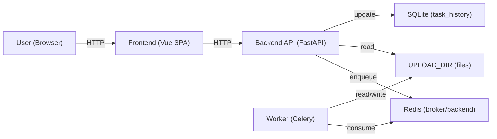

# Architecture

This project is an AI subtitle generation + editing tool with:

- **Backend API**: FastAPI (HTTP)
- **Async processing**: Celery + Redis
- **Frontend**: Vue 3 SPA (polling)
- **Storage**: filesystem outputs under `UPLOAD_DIR` + a small SQLite recent-task store

---

## Components

---

## Request / task flow

1) **Upload**
   - `POST /upload` receives a video file + options.
   - Backend validates:
     - filename extension
     - MIME type (best effort; browser-provided)
     - actual content via `ffprobe`
     - max size (2GB)
   - Backend stores the file under `UPLOAD_DIR/{task_id}.{ext}`
   - Backend enqueues a Celery task with `task_id` as business identifier.

2) **Processing**
   - Worker runs `process_video_task`:
     - optional silence removal
     - chooses whisper model by duration
     - parallel path (Celery chord) when enabled + long duration
     - merges segment results into a single timeline
     - optional translation (OpenAI; only when configured)
     - generates subtitle files (`.srt` always; `.ass` optional by request)
     - produces final output video (`{task_id}_final.mp4`) by burning subtitles (or copy)

3) **Frontend status**
   - Frontend polls `GET /status/{task_id}`.
   - When status is `SUCCESS`, frontend fetches `GET /results/{task_id}` for outputs.

4) **Results / editing**
   - `GET /results/{task_id}` enumerates available subtitle files under `UPLOAD_DIR`.
   - `GET /subtitle/{task_id}?lang=...&format=...` reads a subtitle file.
   - `PUT /subtitle/{task_id}?lang=...` writes subtitle updates atomically.
   - Editing subtitles does **not** rebuild the final video automatically (explicit rebuild is a separate UX/API decision).

---

## Data contracts (high level)

- **Task status**: `task_id`, `status`, `progress`, optional `warnings`, optional `result_url`
- **Results manifest**: `task_status`, `has_video`, `available_files[]`, `warnings[]`, and flags for partial/orphan detection
- **Subtitle read/write**: `content`, `format`, `filename` (+ update response message + warnings)

See `backend/main.py` and `frontend/src/types/*` for exact fields.

